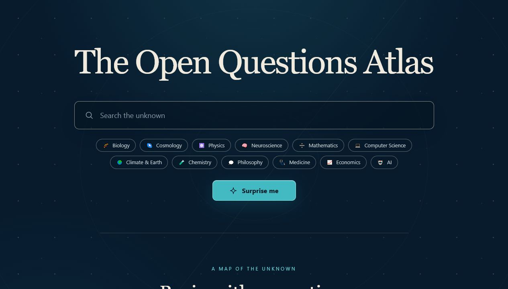

# The Open Questions Atlas

> A calm, searchable map of the questions humanity has not answered yet.

The Open Questions Atlas turns open problems into a place to wander. Search by
phrase, choose a region of the atlas, follow a curated trail, or choose
**Surprise me** and let a non-repeating question find you.

Live site: [purysho.github.io/OpenQuestionAtlas](https://purysho.github.io/OpenQuestionAtlas/)

## Interface preview



## Explore

- **Atlas regions** — browse the unknown by field, from cosmology to medicine.
- **Curated trails** — follow a short thread through origins, time, or the mind.
- **Question of the week** — begin with one carefully chosen open problem.
- **Related questions** — keep following a line of inquiry without leaving the atlas.
- **Shareable links** — every question and trail has a stable URL you can send to someone else.
- **Add to sky** — every question card has an **Add to sky ✦** button that opens
  [Lodestar](https://purysho.github.io/Lodestar/) with the question pre-loaded as
  a star (tagged `origin: "atlas"`), so a question that stayed with you lands in
  your personal night sky.

## The trilogy handoff

The Atlas is a stateless discovery tool; [Lodestar](https://purysho.github.io/Lodestar/)
is the memory layer. **Add to sky** encodes the question into a small payload in
the Lodestar URL hash (`…/lodestar/#/add?s=<encoded>`) — no backend, no shared
storage, the URL is the whole wire. The shared payload + encoding contract lives
in [`src/lib/starLink.js`](src/lib/starLink.js), copied verbatim from Lodestar
and covered by a round-trip test so the sender and receiver never drift.

Want to help grow the map? Open an issue with the **Add a sourced open question**
template, or read [CONTRIBUTING.md](CONTRIBUTING.md).

## Quick start

```sh
npm install
npm run dev
npm test
```

Node 20 is the supported runtime. The development server prints the local URL.

## How it works

The browser fetches only static JSON under `public/data/`. `index.json` is the
manifest: the loader fetches every dataset it lists, validates entries against
`schema.json`, drops and logs invalid or unsourced entries, merges the valid
records, and removes duplicate IDs. No backend, database, API key, or external
runtime API is involved.

That manifest is the seam between today's curated seed and future source
imports. Adding another static dataset should require a new JSON file plus one
manifest entry; the React application should not change.

## The philosophy

Most knowledge products organize answers. This one maps the edges of knowledge
instead. Each question is treated as the hero, with enough context to understand
why it remains open and a direct path into the source material.

Every shipped question must be traceable. A smaller honest atlas is better than
a larger one padded with invented questions, authors, or URLs.

## Growing the atlas (Path B ingest)

The manifest seam also lets a build-time pipeline add whole datasets from
permitted external sources. `scripts/ingest/` fetches a source, reformats it
into the schema, and writes static JSON to `public/data/` plus an updated
`index.json` and `LICENSES.md`. The app is untouched — it just sees more files.

Adding a source is: confirm its license, write one adapter, register it, and run
`npm run ingest`. Full instructions, the adapter contract, and the rules
(license gate, no fabrication, and the **Wikenigma link-don't-ingest / no-scrape**
policy) are in [scripts/ingest/README.md](scripts/ingest/README.md). The
Erdős Problems dataset is the worked example.

## Scripts

- `npm run dev` starts Vite.
- `npm test` runs the loader and discovery tests once.
- `npm run lint` runs the repository's source/build validation gate.
- `npm run build` creates the static production site in `dist/`.
- `npm run ingest` runs the build-time ingest pipeline (see above); it is never
  part of the app or the deploy.

## Contributing

Question curation is the heart of this project. Read [CONTRIBUTING.md](CONTRIBUTING.md)
before adding or changing data. In particular, use an approved primary source,
record its real URL and license on every entry, and run all three gates.

Good first contributions include adding a small sourced batch in an underexplored
field, proposing a curated trail, or improving a question's tags. The repository
issue form walks through the source and licensing information needed for each
proposed question.

## Licenses

Application code is available under the [MIT License](LICENSE). Question data
keeps its source-specific terms; see [LICENSES.md](LICENSES.md).
